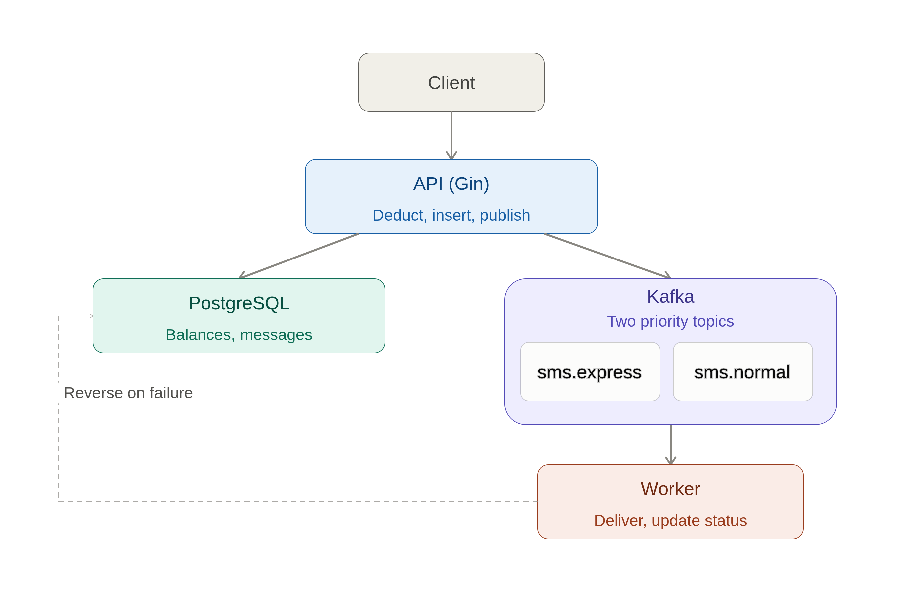
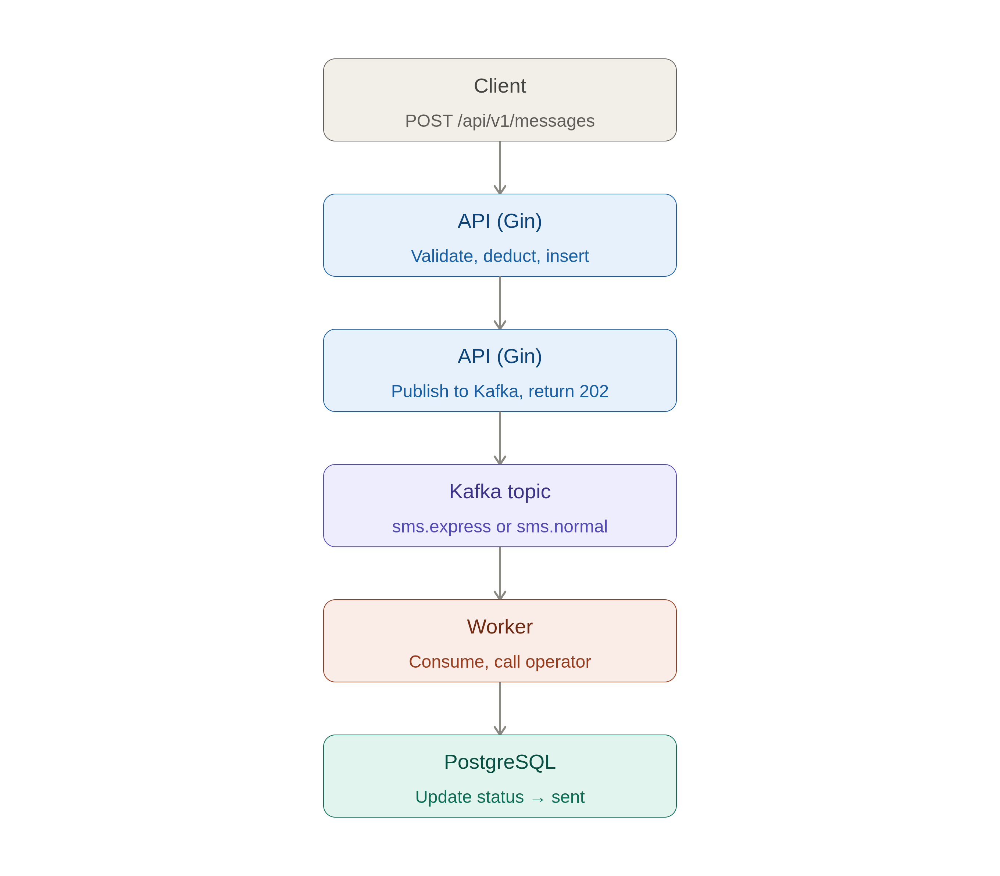
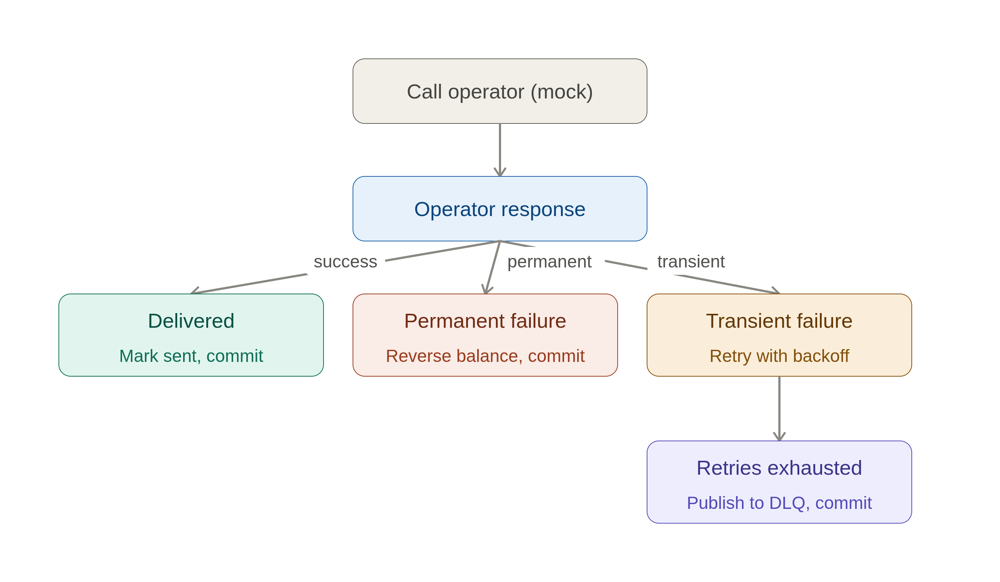

# SMS Gateway

A prepaid SMS gateway built in Go. Businesses top up a balance, then submit Normal or Express SMS messages via a REST API. Messages are delivered asynchronously through Kafka priority queues while balances are deducted atomically in the same database transaction.

## Architecture



**Components:**

| Component | Responsibility |
|-----------|---------------|
| **API** | Validates requests, atomically deducts balance + inserts message, publishes to Kafka |
| **PostgreSQL** | Source of truth for balances, messages, transactions, and pricing |
| **Kafka** | Two priority topics: `sms.express` and `sms.normal` (+ DLQ variants) |
| **Worker** | Idempotent consumer — delivers to mock operator, updates status, reverses balance on permanent failure |
| **Operator adapter** | Swappable interface; ships with a mock that simulates ~1% permanent and ~2% transient failures |

### Success Flow



### Failure & DLQ Flow



## Prerequisites

- [Docker](https://docs.docker.com/get-docker/) + [Docker Compose](https://docs.docker.com/compose/)
- Go 1.23+ (only needed for running tests or the service locally without Docker)

## Quick Start

```bash
# Clone and start all services (postgres, kafka, migrate, api, worker)
git clone https://github.com/OmidRasouli/sms-gateway-task.git
cd sms-gateway-task
make up
```

The API will be available at `http://localhost:8080`.

To stop and remove volumes:

```bash
make down
```

## Running Locally (without Docker)

Start PostgreSQL and Kafka separately (or use `docker compose up postgres kafka`), then:

```bash
make run-api     # starts the HTTP API on :8080
make run-worker  # starts the Kafka consumer in a separate terminal
```

Apply migrations first if needed:

```bash
make migrate-up
```

## Configuration

All configuration is via environment variables:

| Variable | Default | Description |
|----------|---------|-------------|
| `PORT` | `8080` | HTTP listen port |
| `DATABASE_URL` | *(required)* | PostgreSQL DSN |
| `KAFKA_BROKERS` | `localhost:9092` | Comma-separated Kafka broker addresses |
| `EXPRESS_CONCURRENCY` | `15` | Worker goroutines consuming `sms.express` |
| `NORMAL_CONCURRENCY` | `10` | Worker goroutines consuming `sms.normal` |
| `PRICE_CACHE_REFRESH_INTERVAL` | `5m` | How often the in-memory price cache is refreshed from the DB |
| `MAX_RETRY_ATTEMPTS` | `3` | Maximum Kafka consumer retry attempts before a message is sent to the DLQ |
| `LOG_LEVEL` | `info` | Log verbosity: `trace`, `debug`, `info`, `warn`, `error`, `fatal`, `panic` |
| `LOG_FORMAT` | `json` | Log output format: `json` (structured, production) or `pretty` (human-readable console) |

## API Reference

All endpoints accept and return `application/json`. The caller identifies itself via the `X-User-ID` header (a UUID). Authentication is **explicitly out of scope** for this challenge.

### Health Check

```
GET /healthz
```

Returns `200 OK` when the service is up.

---

### Send a Message

```
POST /api/v1/messages
X-User-ID: <uuid>
```

**Request body:**

```json
{
  "phone_number": "+14155552671",
  "text": "Hello!",
  "type": "normal"
}
```

`type` is either `normal` or `express`.

**Response `202 Accepted`:**

```json
{
  "id": "550e8400-e29b-41d4-a716-446655440000",
  "user_id": "...",
  "phone_number": "+14155552671",
  "text": "Hello!",
  "type": "normal",
  "price": 10,
  "status": "pending",
  "created_at": "2026-07-12T10:00:00Z"
}
```

**Error responses:**

| Status | Condition |
|--------|-----------|
| `400` | Missing/invalid `X-User-ID`, bad JSON, invalid phone or text |
| `402` | Insufficient balance |
| `500` | Internal error |

---

### List Messages

```
GET /api/v1/messages/:userID
```

Returns the last 50 messages for the user.

---

### Get a Single Message

```
GET /api/v1/messages/:userID/:id
```

---

### Get Balance

```
GET /api/v1/balance/:userID
```

**Response `200 OK`:**

```json
{ "user_id": "...", "amount": 990 }
```

---

### Get Transaction History

```
GET /api/v1/transactions/:userID?limit=20
```

Returns balance transactions (debits and credits). `limit` defaults to 20, max 100.

---

### Top Up Balance

```
POST /api/v1/balance/charge
```

**Request body:**

```json
{ "user_id": "...", "amount": 1000 }
```

**Response `200 OK`:**

```json
{ "user_id": "...", "new_balance": 1990 }
```

## Example cURL Workflow

```bash
USER_ID="550e8400-e29b-41d4-a716-446655440000"

# 1. Top up balance
curl -s -X POST http://localhost:8080/api/v1/balance/charge \
  -H "Content-Type: application/json" \
  -d "{\"user_id\": \"$USER_ID\", \"amount\": 1000}" | jq

# 2. Send a normal SMS
curl -s -X POST http://localhost:8080/api/v1/messages \
  -H "Content-Type: application/json" \
  -H "X-User-ID: $USER_ID" \
  -d '{"phone_number": "+14155552671", "text": "Hello!", "type": "normal"}' | jq

# 3. Send an express SMS
curl -s -X POST http://localhost:8080/api/v1/messages \
  -H "Content-Type: application/json" \
  -H "X-User-ID: $USER_ID" \
  -d '{"phone_number": "+14155552671", "text": "Urgent!", "type": "express"}' | jq

# 4. Check balance
curl -s http://localhost:8080/api/v1/balance/$USER_ID | jq

# 5. List messages
curl -s http://localhost:8080/api/v1/messages/$USER_ID | jq
```

## Pricing

Prices are stored in the `message_pricing` table and cached in memory (refreshed every 5 minutes).

| Type | Default Price (units) |
|------|-----------------------|
| `normal` | 10 |
| `express` | 25 |

## Database Schema

| Table | Purpose |
|-------|---------|
| `balances` | One row per user; `amount >= 0` enforced at the DB level |
| `messages` | All submitted messages with current status |
| `balance_transactions` | Immutable ledger of every debit and credit |
| `message_pricing` | Configurable price per message type |

## Testing

```bash
# Unit tests
make test

# Integration tests (requires a running PostgreSQL)
make test-integration
```

## Key Design Decisions

**Structured logging** — All components (API, worker, consumer loop) emit structured JSON logs via [zerolog](https://github.com/rs/zerolog). Each log line carries typed fields (`message_id`, `user_id`, `status`, `latency`, etc.) rather than interpolated strings, making log aggregation and alerting straightforward. Log level and format are runtime-configurable via `LOG_LEVEL` and `LOG_FORMAT`. Set `LOG_FORMAT=pretty` during local development for colour-coded, human-readable output.

**Atomic balance deduction** — A single `UPDATE balances SET amount = amount - $1 WHERE user_id = $2 AND amount >= $1` runs in the same transaction as the message insert. This makes it impossible for the balance to go negative, even under high concurrency, without needing advisory locks or `SELECT FOR UPDATE`.

**Kafka over Asynq/Redis** — Kafka's consumer-group offset model gives durable, ordered, replayable delivery. The two topics (`sms.express`, `sms.normal`) are consumed with different concurrency levels to implement priority dispatch.

**Idempotent worker** — The handler checks `status == pending` before acting. A Kafka redelivery after a crash cannot double-send or double-deduct because the balance was deducted exactly once (in the API transaction) before the message was ever published.

**Balance reversal on permanent failure** — When the operator returns a permanent error (e.g. invalid destination), the worker reverses the deduction via `ReverseDeductTx`, which is also idempotent (guarded by a unique constraint on `(message_id, tx_type)` in `balance_transactions`).

**Per-user partition keying** — Kafka messages are keyed by `userID` (not `messageID`), so all messages for a given user land on the same partition and are consumed in submission order by a single worker goroutine. Balance deduction happens synchronously in the API transaction, not in the worker, so this ordering isn't required for deduction correctness. It's kept instead as a foundation for future per-user fairness/rate-limiting (noted in Known Limitations as not yet implemented) — without per-user ordering, a fairness mechanism can't reason about a user's message sequence. The trade-off is partition hotspotting: a small number of high-volume users can concentrate load on a few partitions rather than spreading evenly across all of them.

## Scale & Capacity

These are back-of-envelope estimates based on stated design targets, not measured benchmarks. All assumptions are noted inline.

**Throughput target**

100 M messages/day averages to ~**1,160 msg/sec**. Assuming a 3×–5× peak-to-average ratio during business hours (a common rule of thumb for B2B messaging), the system needs to sustain roughly **3,500–5,800 msg/sec at peak**.

**Worker goroutines needed**

Assuming each delivery call to the operator (network round-trip + DB status update) takes ~**50 ms** end-to-end, a single goroutine can process ~20 msg/sec. To hit the ~5,800 msg/sec peak requires ~**290 goroutines** total across both topics. The current defaults (`EXPRESS_CONCURRENCY=15`, `NORMAL_CONCURRENCY=10` → 25 total) are sized for development/demo use and would need to be scaled out significantly.

| Scenario | Avg msg/sec | Peak msg/sec (5×) | Goroutines needed (@ 50 ms/msg) |
|---|---|---|---|
| Current defaults (1 instance) | — | — | 25 |
| 100 M/day, 1 worker pod | 1,160 | ~5,800 | ~290 |
| 100 M/day, 10 worker pods | 1,160 | ~5,800 | ~29 per pod |

**Horizontal scaling**

Worker instances join the same Kafka consumer group, so Kafka distributes partitions across them automatically. **Partition count is the hard ceiling on parallelism** — a partition is only ever consumed by one goroutine at a time within the group, so the number of partitions must be at least as large as the number of concurrent goroutines the system needs. To support the ~290 goroutines above, each topic needs partition counts in that same order of magnitude, split roughly in proportion to the current 15:10 express/normal concurrency ratio — e.g. ~**170 partitions on `sms.express`** and ~**115 on `sms.normal`**, rather than a fixed 32–64 regardless of target load. Scaling is then a matter of increasing `EXPRESS_CONCURRENCY`/`NORMAL_CONCURRENCY` and spinning up additional worker pods until the partition ceiling is reached.

**Partition hotspotting at scale**

With `userID`-based keying, a user sending a disproportionate share of traffic monopolises one partition. At 100 M/day, if the top 1% of senders account for 30–50% of volume (a rough power-law assumption), those partitions will run 30–50× hotter than average, bottlenecking throughput and adding latency for every other user sharing that partition. Mitigation options include composite keys (`userID + bucket`), message-ID keying with ordering relaxed, or per-user rate limiting — none of which are currently implemented (see Known Limitations).

**PostgreSQL write throughput**

Each message involves four writes: three in the API's transaction (message insert, balance deduction, and the immutable `balance_transactions` ledger insert) plus one status update from the worker after delivery. At the ~3,500–5,800 msg/sec peak, that's roughly **14,000–23,000 writes/sec** the database needs to sustain. Reaching this comfortably requires connection pooling (PgBouncer in transaction mode), vertical scaling of the PostgreSQL instance, and potentially read replicas for the query endpoints — detailed DB tuning is out of scope for this challenge.

## Known Limitations

- Mock operator only — no real telecom integration.
- No per-user rate limiting beyond queue priority weighting.
- No refund sweep for messages that crash after balance deduction but before Kafka publish (Outbox Pattern candidate fix).
- Idempotent request timeouts are not implemented. If the API times out after deducting balance but before returning a response, the client may retry and see a `402 Insufficient Balance` even though the message was accepted. A real-world implementation would need a request ID or idempotency key to avoid this.
- No correlation ID propagation from API to worker logs. In a production system, the API would generate a `X-Request-ID` header and pass it through Kafka headers to the worker for end-to-end traceability.
- No cache layer for some api endpoints (e.g., balance, transaction history) — all queries hit the database directly. A real-world system might add Redis or similar for read-heavy endpoints.
- No metrics or monitoring dashboards. In production, Prometheus/Grafana or similar would be added to track message throughput, failure rates, queue depth, etc.
- Invalidation cache instead of refresh cache for price cache. Currently, the price cache is refreshed every 5 minutes, which may lead to stale prices if the database is updated in between. A more robust approach would be to invalidate the cache on price updates.
